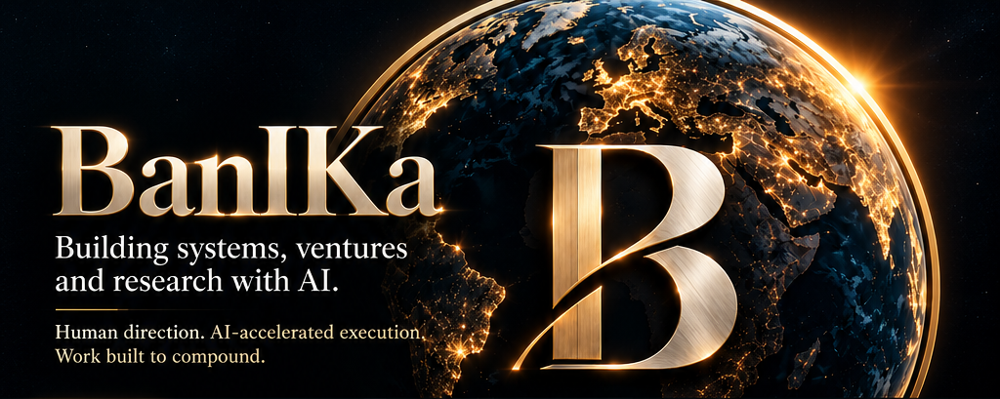
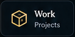
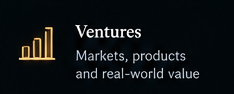
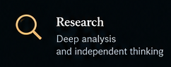
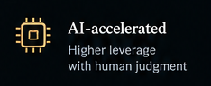
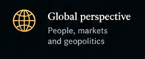
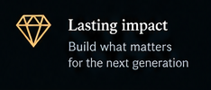

<p align="center">
  <a href="https://banika.me"></a>
  <a href="#selected-work"></a>
  <a href="#featured-research"></a>
  <a href="#notes"></a>
  <a href="#now"></a>
  <a href="#company"></a>
  <a href="#contact"></a>
</p>

<table>
  <tr>
    <td valign="top" width="50%">

```js
const BanIKa = {
  builds: ["systems", "ventures", "research"],
  company: "Patoshi Agency",
  website: "banika.me",
  worksWith: "AI",
  direction: "human",
  focus: ["clarity", "execution", "verification"]
}
```

  </td>
    <td valign="top" width="50%">
      <table>
        <tr>
          <td><a href="#what-i-build"></a></td>
          <td><a href="#selected-work"></a></td>
        </tr>
        <tr>
          <td><a href="#featured-research"></a></td>
          <td><a href="#how-i-work"></a></td>
        </tr>
        <tr>
          <td><a href="#about"></a></td>
          <td><a href="#evolution"></a></td>
        </tr>
      </table>
    </td>
  </tr>
</table>

---

<a id="selected-work"></a>

## 01 / Selected Work

[](https://doro.vip)

### d'ORO

A venture connecting physical product, brand and digital experience in one public ecosystem.

d'ORO presents a bottled-water product through a unified commerce and brand surface at doro.vip. It represents venture-building across physical product, brand identity, digital presentation and customer-facing commerce.

**Status:** Active (public venture presence)  
[Visit doro.vip](https://doro.vip)

---

<a id="now"></a>

## 02 / Now

**Building**  
BanIKa personal presence, GitHub profile and current ventures.

**Researching**  
AI-enabled systems, decision architecture, markets and infrastructure.

**Exploring**  
New problems, ventures and research worth pursuing.

---

<a id="what-i-build"></a>

## 03 / What I Build

**AI-enabled systems**  
Practical systems where AI contributes to execution under clear human direction.

**Ventures & markets**  
Products, platforms and market-facing initiatives shaped around material problems.

**Research & decisions**  
Structured investigation and decision architecture that informs what to build—and what to defer.

---

<a id="featured-research"></a>

## 04 / Featured Research

Research is an active part of my work across systems, markets, infrastructure and decision-making.

Public research will appear here as individual investigations become ready for publication.

---

<a id="notes"></a>

## 05 / Notes

Working notes, ideas and short-form thinking will appear here as they become ready to share.

---

<a id="company"></a>

## 05 / Company

### Patoshi Agency

AI-enabled digital work, products and execution.

[Visit patoshi.agency →](https://patoshi.agency)

---

<a id="how-i-work"></a>

## 06 / How I Work

Understand the problem.  
Choose what matters.  
Build and verify.

I use AI across research, analysis, design and implementation while retaining responsibility for scope, trade-offs, decisions and acceptance.

---

<a id="evolution"></a>

## 07 / Evolution

**2020 → now**

From early digital and Web3 exploration to a broader focus on ventures, research and human-directed AI systems.

---

<a id="about"></a>

## 08 / About

I work across ventures, research and systems design. I use AI extensively, but not as a substitute for judgment. My role is to frame problems, establish constraints, evaluate alternatives, make decisions and verify what gets built.

---

<a id="contact"></a>

## 09 / Contact

For selected collaboration, projects or relevant conversations:

[banika.me](https://banika.me) · [Patoshi Agency](https://patoshi.agency)

---

<p align="center">
  <strong>BanIKa</strong>
</p>

<p align="center">
  <a href="https://banika.me">banika.me</a> · <a href="https://github.com/Bucuresteanul">GitHub</a> · <a href="https://patoshi.agency">Patoshi Agency</a>
</p>
