

<table width="92%" align="center">
<tr>
<td width="50%" valign="top">
<pre><code>const BanIKa = {
  builds: ["systems", "ventures", "research"],
  company: "Patoshi Agency",
  website: "banika.me",
  worksWith: "AI",
  direction: "human",
  focus: ["clarity", "execution", "verification"]
}</code></pre>
</td>

<td width="50%" valign="top" align="center">

 

 

</td>
</tr>
</table>

## 01 / Selected Work

<a href="https://banika.me">More at banika.me →</a>

## 02 / What I Build

**AI-enabled systems**  
Practical systems where AI contributes to execution under clear human direction.

**Ventures & markets**  
Products, platforms and market-facing initiatives built around material problems and opportunities.

**Research & decisions**  
Structured investigation and decision architecture that informs what to build, what to change and what to defer.

## 03 / Current Focus

<table width="100%">
<tr>

<td width="33%" valign="top" align="center">
 
<a href="#selected-work">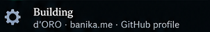</a> 
<a href="#featured-research">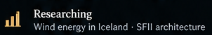</a> 
<a href="#notes">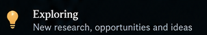</a>
</td>

<td width="34%" valign="top" align="left">

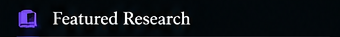 
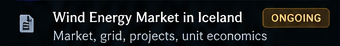 
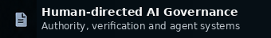 
 
<a href="https://banika.me">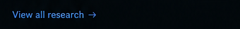</a>
</td>

<td width="33%" valign="top" align="left">

<a href="https://patoshi.agency">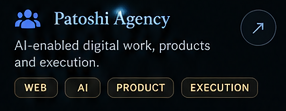</a> 
<a href="https://github.com/Bucuresteanul">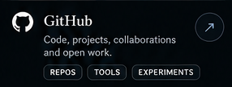</a>
</td>

</tr>
</table>

## 04 / How I Work

**Understand the problem.**  
**Choose what matters.**  
**Build and verify.**

I use AI across research, analysis, design and implementation while retaining human responsibility for scope, trade-offs, decisions and acceptance.

## 05 / Notes

Working notes, ideas and short-form thinking — shared when they are ready to be useful.

## 06 / Evolution

**2020 → now**

From early digital and Web3 exploration to a broader focus on ventures, research and human-directed AI systems.

The principle remains the same: do not erase history — show evolution.

## 07 / About

<a href="https://banika.me">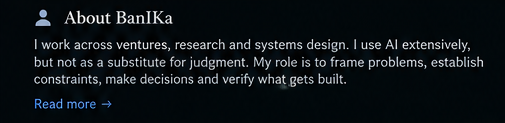</a>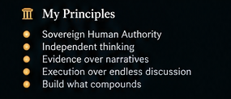

## 08 / Contact

For selected collaborations, projects and relevant conversations:

<a href="https://banika.me">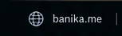</a><a href="https://github.com/Bucuresteanul">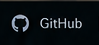</a><a href="https://patoshi.agency">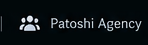</a><a href="#contact">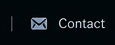</a>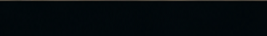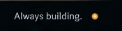

