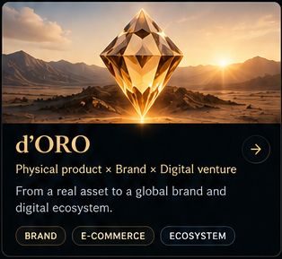
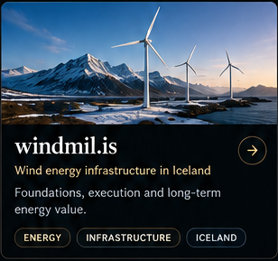
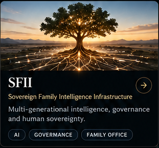

  
  
  
  
  
  
  

<table width="100%">
<tr>
<td width="50%" valign="top">
<pre><code>const BanIKa = {
  builds: ["systems", "ventures", "research"],
  company: "Patoshi Agency",
  website: "banika.me",
  worksWith: "AI",
  direction: "human",
  focus: ["clarity", "execution", "verification"]
}</code></pre>
</td>
<td width="50%" valign="top" align="center">

 

 

</td>
</tr>
</table>

---

## 01 / Selected Work

  <a href="https://banika.me">View all projects →</a>

  
  
  

---

<table width="100%">
<tr>
<td width="33%" valign="top">

<h3>🟢 Now</h3>

⚙️ <strong><a href="#selected-work">Building</a></strong> 
BanIKa · d'ORO · personal digital presence

📊 <strong><a href="#featured-research">Researching</a></strong> 
Wind energy · AI systems · decision architecture

💡 <strong><a href="#notes">Exploring</a></strong> 
New ventures, research questions and opportunities

</td>
<td width="34%" valign="top">

<h3>🟣 Featured Research</h3>

📄 <strong>Wind Energy Market in Iceland</strong> 
Market, grid, projects and unit economics 
<code>ONGOING</code>

📄 <strong>Human-directed AI Governance</strong> 
Authority, verification and agent systems

📄 <strong>Decision Architecture Under Uncertainty</strong> 
Evidence, trade-offs and scope control

<a href="https://banika.me">View all research →</a>

</td>
<td width="33%" valign="top">

<h3><a href="https://patoshi.agency">Patoshi Agency ↗</a></h3>

AI-enabled digital work, products and execution.

<code>WEB</code> <code>AI</code> <code>PRODUCT</code> <code>EXECUTION</code>

<h3><a href="https://github.com/Bucuresteanul">GitHub ↗</a></h3>

Projects, repositories, tools and experiments.

<code>REPOS</code> <code>TOOLS</code> <code>EXPERIMENTS</code>

</td>
</tr>
</table>

---

## 03 / What I Build

**AI-enabled systems**  
Practical systems where AI contributes to execution under clear human direction.

**Ventures & markets**  
Products, platforms and market-facing initiatives shaped around material problems.

**Research & decisions**  
Structured investigation and decision architecture that informs what to build—and what to defer.

---

## 05 / Notes

Working notes, ideas and short-form thinking will appear here as they become ready to share.

---

## 06 / How I Work

Understand the problem.  
Choose what matters.  
Build and verify.

I use AI across research, analysis, design and implementation while retaining responsibility for scope, trade-offs, decisions and acceptance.

---

## 07 / Evolution

**2020 → now**

From early digital and Web3 exploration to a broader focus on ventures, research and human-directed AI systems.

---

## 08 / About

I work across ventures, research and systems design. I use AI extensively, but not as a substitute for judgment. My role is to frame problems, establish constraints, evaluate alternatives, make decisions and verify what gets built.

---

## 09 / Contact

For selected collaboration, projects or relevant conversations:

[banika.me](https://banika.me) · [Patoshi Agency](https://patoshi.agency)

---

  <strong>BanIKa</strong>

  <a href="https://banika.me">banika.me</a> · <a href="https://github.com/Bucuresteanul">GitHub</a> · <a href="https://patoshi.agency">Patoshi Agency</a>

